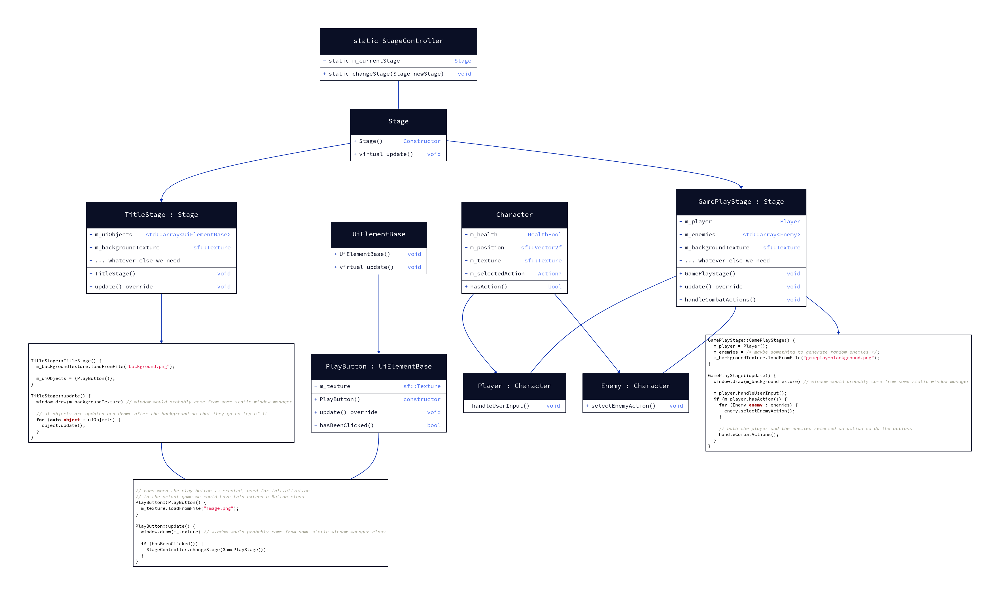

# Battle of the Boxes

Brief description of your project (1–2 sentences).
A resource efficent deck builder game built using sfml and C++. Once the player starts the game,
they are a box with a health bar and block bar. They are playing against a worker from the warehouse,
who is trying to attack them. The main premise is that the box is trying to escape the warehouse, and
the workers are trying to keep them there. Potentially later on, the final boss would be a battle against
Jeff Bezos. 

---
## Team Members
- Ethan Pedrick
- Fisher Nowicki
- Brittney Moore
- Woodolph Sylvain
---

## Setup Instructions:
1. Clone the repository locally.
2. Open the project in your IDE.

the build/run buttons should work in your IDE

### windows
if you are using visual studio then install git from here: https://git-scm.com/install/ <br>
even if you already have git installed from visual studio you need install it again from the above link

### linux
to build manually in a terminal
```bash
cmake -B build
cmake --build build
```
make sure you have all of sfml's requirements found on [sfml's documentation](https://www.sfml-dev.org/tutorials/3.0/getting-started/cmake/#customize-the-cmake-project-and-executable-names)

---
## Features
- Feature 1 card decks
- Feature 2 pass button
- Feature 3 discard button
- Feature 4 exit button accessible from title and battle menu
- Feature 5 block and attack
- Feature 6 the characters box and worker along with a background image
- Feature 7 player name input on title screen

---
## OOP Concepts Used
## Encapsulation
All classes’ members are private
Getter and setter functions are used if necessary
Characters have getHealthPool() methods to get access to a character’s health pool

## Abstraction
Updatable is an abstract class
Allows Stages and UiButtons to update when necessary
Stage and UiButton implement update() differently

## Inheritance
PlayerCharacter and Enemy extend Character
Ui elements extend UiElementBase

## Polymorphism / Composition
Card is a base class with virtual use() method
BasicAttack and Block implement use() differently.
Characters are built from smaller parts like Deck and HealthPool

## Team Contributions
### Member 1: Ethan 
- Project File structure management; general class creation and organization
- CombatSequence, card use validation
- Created sprites for the zombie worker and box
- Code reviewer and debugger.
- feature suggestor
### Member 2: Fisher
- Planning and implementation of underlying Stage system
- Setting up cmake build configuration with sfml
- Code reviewer and debugger
- Implemented change to code for project functionality on windows
- feature suggestor
### Member 3: Brittney
- built the pass button
- built the discard button
- Code reviewer and debugger
- feature suggestor
### Member 4: Woodoplh 
- Added exit button and battle stage menu system
- Added background image
- Debugged and fixed UiButton click detection
- Added Player name input fiel to title screen
-  Created deadlines and tasks to be assigned in terms of features to be implemented or issues to be      resolved.
-  feature suggestor
  
---

## AI and External Resources Disclosure (Required)
You must clearly document **all external help used** in this project.
### AI Tools
List any AI tools used (e.g., ChatGPT, Copilot, etc.) and describe:
- What you asked the AI to do
- What code or explanation it generated
- What you modified or learned from it
Example:
- ChatGPT: Helped generate initial structure for the Task class. We
modified variable names, added validation, and integrated it with our
TaskManager.

## AI tools used

-Github AI: Helped to solve errors that we came across.
- Claude: Helped to solve errors we came across, especially after trying to debug it for 30+ mins.
- ChatGPT: Helped to solve errors came across, pasting the error into ChatGPT to figure why it wasn't working.
  AI was used for debugging compile errors and to figure out better ways of implementation of features for either efficiency or brevity. All code output from AI were reviewed and used as learning material.
  

### External Resources
List all non-AI resources used:
- Websites (e.g., Stack Overflow, tutorials)
- Documentation
- YouTube videos
- Sample code
Include links when possible.

Applications used: 
-MS Visual Studios and other IDE.

Youtube videos used:
-Youtube Video on Github https://www.youtube.com/watch?v=a9u2yZvsqHA
-Youtube Video on Guthub https://www.youtube.com/watch?v=Oaj3RBIoGFc&t=633s
-Youtube video on SFML https://www.youtube.com/watch?v=yEiZalvDOj4&t=457s
-Youtube video on pointers https://www.youtube.com/watch?v=eNofmKYzje4

Websites Used:
-https://www.king5.com/article/news/local/senate-investigation-amazon-warehouse-worker-injuries/281-e845aa31-8da2-4ee4-94b3-e6f350ac1cf5 (used thumbnail as battlestage background)
-https://pixelartvillage.com(used to decrease image resolution to create pixel art to match sprites)

For communication: 
-Discord (website/app)

### Collaboration Policy Statement
All submitted work reflects our team’s understanding. Any external code
has been:
- Reviewed
- Modified as needed
- Integrated by our team


### Controls
-The player uses their moouse to interact with all buttons and cards on screen. These cards be dragged onto either the player itself or the enemy and be used on them. 
-The player also types their into the input box on title screen using the keyboard.

## Project Requirements
### OOP Requirements
- __Classes & Objects__
  - multiple classes and objects interact to form the project
- __Encapsulation__
  - all class data members are private and use methods to modify their values
  - m_currentStage within the StageController class is private. to change the value of m_currentStage you must use the changeStage method
- __Composition__
  - Character "has-a" HealthPool component
- __Inheritance__
  - PlayerCharacter and Enemy are derived classes of Character
- __Templates__
  - getWindowSize template returns the window size in any sf::Vector2 type, performing the conversion to the target sf::Vector2 type for you 
- __Polymorphism__
  - The Card class has a virtual __use__ method which is used with an array of Card derived objects in the Character class
- __Abstract Classes__
  - The __use__ method within the Card class is a pure virtual function
### Programming Requirements
- Use of:
  - Functions
    - functions are used in every class
  - Control structures
    - Control structures are used throughout function implementations
  - Arrays and/or vectors
    - A vector is used for managing the list of cards within a Deck object
- Exception Handling
  - loading textures are within try blocks, sfml throws a sf::Exception exception which is then caught and an error message is displayed
  - sfml loads textures relative to the current working directory (CWD), which is set to the exe's directory when launching the game. The code to set the CWD is wrapped in a try block to catch any errors thrown when trying to set the CWD and displays an error message in case of failure.
### GUI Requirements
- Event-driven GUI
  - sfml uses an event loop to manage user input and drawing graphics to the screen
- 3 different interactive components
  - Buttons such as start or exit buttons
  - Cards that increase in scale when hovered can be dragged around the screen
  - Name entry text box on title screen
- Input validation
  - clicking of buttons validate that the user's mouse is hovering over the button before it sets the m_clicked data member to true
- Clear, user-facing error messages
  - an error message is given when image files required by the game are failed to be found
- Logical layout and usability
  - layout of the gui is sensical and uses ratios of screen width and height for positioning rather than arbitrary numbers
  - gui elements are reactive to user input and show that they are working with every action
 
## UML diagram

to generate an image from the d2 code run: d2 uml.d2 uml.png


## Additional Notes
- We initially had a much larger project but condensed it due to time constraints
